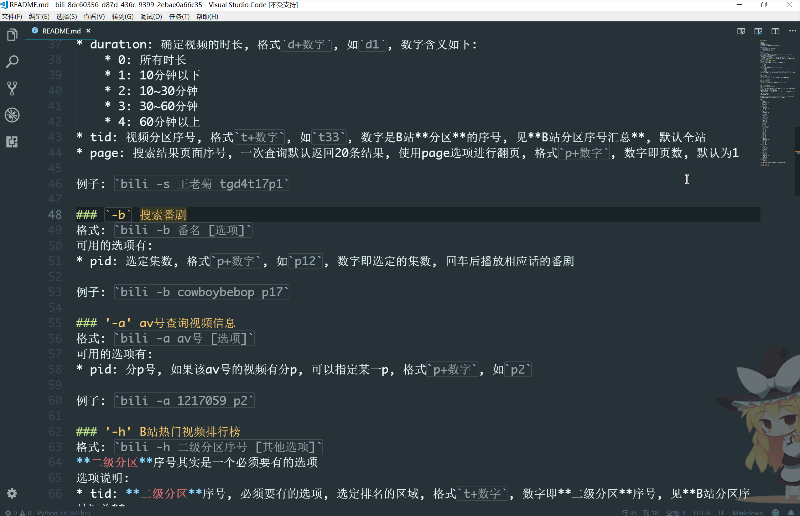

# 一个Wox的B站插件
点子来自这个项目[BilibiliAlfredWorkFlows][4]
## 功能
* B站视频搜索
* B站番剧搜索
* B站分区热门视频排行
* 由av号获取B站视频信息
* 选中视频回车, 直达播放页面全屏播放(需要其他脚本支持)

## 安装
* 直接使用Wox安装
    * 首先下载安装 [wox][1], 启动打开命令框: 
    * 输入 `wpm install bili` 安装插件
* 下载插件包手动安装
    * 细节参考 [wox文档][2] 插件安装

## 食用方法
* 一般格式 `bili -x 关键字 [选项]`
    * 激活关键字为`bili`, 可通过[wox][2]设置更换
    * x是模式的代号(一个特定字母), 目前有`s`(search)用于B站视频搜索, `b`(bangumi)用于番剧搜索, `a`(av号)用于由av号查询视频信息, `h`(hot)用于获取热门视频排行
    * 若需要多个关键字请使用逗号分隔
    * 选项部分是可选的, 用于辅助, 如在搜索视频的模式下, 通过设置可以改变结果排序顺序, 限制搜索分区等缩小搜索范围, 更快找到想要的视频. 不同模式下的选项略有不同, 参见下面不同模式的详细说明
    * 注意x前的`-`是必须的, 若有选项, 关键字与选项之间的空格也是必须的, 选项与选项之间可以用空格分隔也可以没有
  
下面说明四种模式的具体用法
### `-s` 搜索B站视频(不包括官方投稿的番剧)
格式: `bili -s 关键字 [选项]`
可用的选项有:
* sortType: 搜索结果的排序类型, 由两个字母构成, 默认按播放量排序, 可选有:
    * sc: 收藏数
    * pl: 评论数
    * bf: 播放量
    * yb: 硬币数
    * dm: 弹幕数
    * tg: 投稿时间(新到旧)
* duration: 确定视频的时长, 格式`d+数字`, 如`d1`, 数字含义如下:
    * 0: 所有时长
    * 1: 10分钟以下
    * 2: 10~30分钟
    * 3: 30~60分钟
    * 4: 60分钟以上
* tid: 视频分区序号, 格式`t+数字`, 如`t33`, 数字是B站**分区**的序号, 见**B站分区序号汇总**, 默认全站
* page: 搜索结果页面序号, 一次查询默认返回20条结果, 使用page选项进行翻页, 格式`p+数字`, 数字即页数, 默认为1

例子: `bili -s 王老菊 tgd4t17p1`

### `-b` 搜索番剧
格式: `bili -b 番名 [选项]`
可用的选项有:
* pid: 选定集数, 格式`p+数字`, 如`p12`, 数字即选定的集数, 回车后播放相应话的番剧

例子: `bili -b cowboybebop p17`

### `-a` av号查询视频信息
格式: `bili -a av号 [选项]`
可用的选项有:
* pid: 分p号, 如果该av号的视频有分p, 可以指定某一p, 格式`p+数字`, 如`p2`

例子: `bili -a 1217059 p2`

### `-h` B站热门视频排行榜
格式: `bili -h 二级分区序号 [其他选项]`
**二级分区**序号其实是一个必须要有的选项
选项说明:
* tid: **二级分区**序号, 必须要有的选项, 选定排名的区域, 格式`t+数字`, 数字即**二级分区**序号, 见**B站分区序号汇总**
* sortType: 排序方式, 与上面搜索视频的选项相同
* page: 排行榜页面序号, 与上面搜索视频的选项相同
* day: 排行榜时间范围, 基准是当前时间, 格式`d+数字`, 数字即天数, 如`d7`表示近一周内的排行, 注意最多只能获取3个月内的排行

例子: `bili -h t33 dmd3`
由于tid也是一个选项故也可以不用空格, 无视顺序, 即`bili -h t33dmd7`和`bili -h dmd7t33`也是可以的, 但必须有tid选项才能获取排行榜

## 已知bug
* 由于wox有自己一套显示项目的排序机制, 故插件返回的排列显示最终可能会错乱, 比如指定按播放量排序, 但最终显示的第一项可能并非最高播放量的视频, 于是插件在每一项开头用数字标注真实的序号

## 关于自动全屏播放的说明
插件在选定项目按回车后会调用执行插件文件夹内的`playVideo.vbs`脚本, 并把选中项目的网站链接作为参数传入, 可以修改该脚本文件以实现自定义行为. 而默认的脚本文件只是在打开网站的基础上, 模拟按键按了几个快捷键而已, B站快捷键的设置需要借助其他脚本, 我使用了这个项目的脚本[bilibili_adjustPlayer][3]

## B站分区序号汇总
* 全站 0
* **动画**: 1
    * AMD·AMV: 24
    * MMD·3D: 25
    * 短片·手书·配音: 47
* **番剧**: 13
    * 连载动画: 33
    * 完结动画: 32
    * 资讯: 51
    * 官方延伸: 152
* **国创**:  167
    * 国产动画: 153
    * 国产原创相关: 168
    * 布袋戏: 169
    * 资讯: 170
* **音乐**: 3
    * 原创音乐: 28
    * 翻唱: 31
    * VOCALOID·UTAU: 30
    * 演奏: 59
    * 三次元音乐: 29
    * OP/ED/OST: 54
    * 音乐选集: 130
* **舞蹈** 129
    * 宅舞: 20
    * 三次元舞蹈: 154
    * 舞蹈教程: 156
* **游戏**: 4
    * 单机游戏: 17
    * 电子竞技: 171
    * 手机游戏: 172
    * 网络游戏: 65
    * 桌游棋牌: 173
    * GMV: 121
    * 音游: 136
    * Mugen: 19
* **科技**: 36
    * 趣味科普人文: 124
    * 野生技术协会: 122
    * 演讲·公开课: 39
    * 星海: 96
    * 数码: 95
    * 机械: 98
    * 汽车: 176
* **生活**: 160
    * 搞笑: 138
    * 日常: 21
    * 美食圈: 76
    * 动物圈: 75
    * 手工: 161
    * 绘画: 162
    * 运动: 163
    * 其他: 174
* **鬼畜**: 119
    * 鬼畜调教: 22
    * 音MAD: 26
    * 人力VOCALOID: 126
    * 教程演示: 127
* **时尚**: 155
    * 美妆: 157
    * 服饰: 158
    * 健身: 164
    * 资讯: 159
* **广告**: 165 166
* **娱乐**: 5
    * 综艺: 71
    * 明星: 137
    * Korea相关: 131
* **影视**: 181
    * 影视杂谈: 182
    * 影视剪辑: 183
    * 短片: 85
    * 预告·资讯: 184
    * 特摄: 86 
* **纪录片**: 177 
    * 人文历史: 37
    * 科学探索: 178
    * 热血军事: 179
    * 舌尖上的旅行: 180
* **电影**: 23  
    * 华语电影: 147
    * 欧美电影: 145
    * 日本电影: 146
    * 其他国家: 83
* **电视剧**: 11 
    * 国产剧: 185
    * 海外剧: 187

注意: 获取热门视频模式只能使用二级分区的序号, 搜索视频模式则没有此限制

[1]: http://www.wox.one/
[2]: http://doc.wox.one/
[3]: https://github.com/mickey7q7/bilibili_adjustPlayer
[4]: https://github.com/Vespa314/BilibiliAlfredWorkFlows